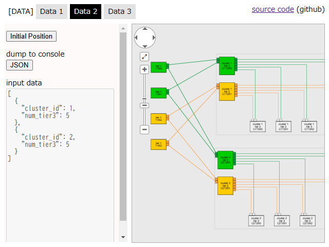
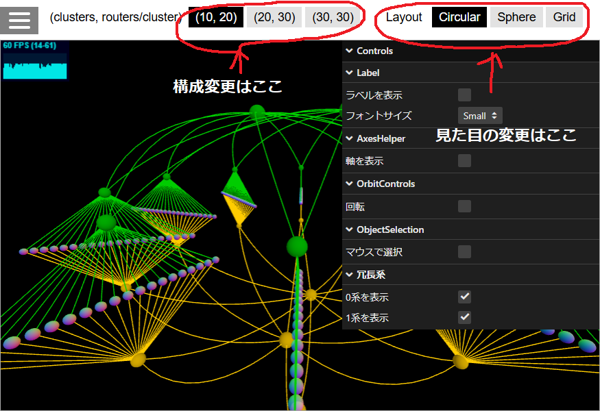
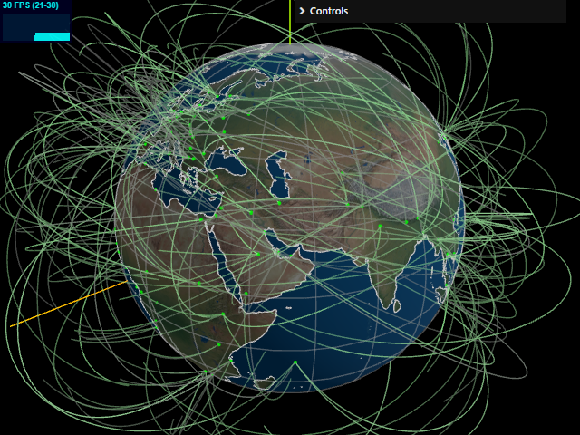
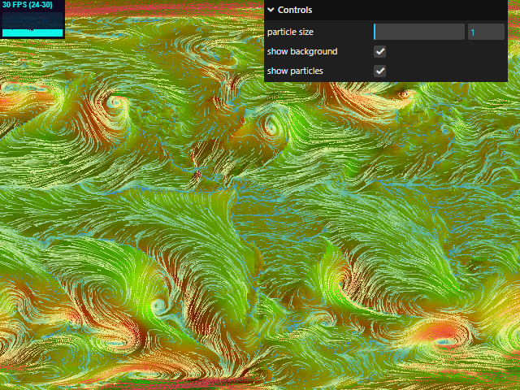

# 5ステージCLOSネットワークを3Dで表示してみた

（このページはAdvent Calendar 2024向けに執筆したものです）

（このページはシンクライアント端末ではなくFAT PCで御覧ください）

<br>

データセンターにおける大規模ネットワークのルーティング技術を調べる機会がありまして、
ベンダー独自の製品・機能について調べつつ、オープンな技術についても調査をしておりました。

この分野で調べを進めていきますと必然的に [RFC7938 Use of BGP for Routing in Large-Scale Data Centers](https://datatracker.ietf.org/doc/html/rfc7938) を読むことになるのですが、その中に書かれている図がこれ（↓）です。

```
                                      Tier 1
                                     +-----+
          Cluster                    |     |
 +----------------------------+   +--|     |--+
 |                            |   |  +-----+  |
 |                    Tier 2  |   |           |   Tier 2
 |                   +-----+  |   |  +-----+  |  +-----+
 |     +-------------| DEV |------+--|     |--+--|     |-------------+
 |     |       +-----|  C  |------+  |     |  +--|     |-----+       |
 |     |       |     +-----+  |      +-----+     +-----+     |       |
 |     |       |              |                              |       |
 |     |       |     +-----+  |      +-----+     +-----+     |       |
 |     | +-----------| DEV |------+  |     |  +--|     |-----------+ |
 |     | |     | +---|  D  |------+--|     |--+--|     |---+ |     | |
 |     | |     | |   +-----+  |   |  +-----+  |  +-----+   | |     | |
 |     | |     | |            |   |           |            | |     | |
 |   +-----+ +-----+          |   |  +-----+  |          +-----+ +-----+
 |   | DEV | | DEV |          |   +--|     |--+          |     | |     |
 |   |  A  | |  B  | Tier 3   |      |     |      Tier 3 |     | |     |
 |   +-----+ +-----+          |      +-----+             +-----+ +-----+
 |     | |     | |            |                            | |     | |
 |     O O     O O            |                            O O     O O
 |       Servers              |                              Servers
 +----------------------------+

                      Figure 3: 5-Stage Clos Topology
```

テキストで表現した構成図としてはものすごく分かりやすいと思うのですが、
パッと見ただけでは **何がどう繋がっているのか、分かりづらい** です。

これだと冗長の系がどうなっているのかをたどるのも大変です。

もう少し可読性のある表現はできないものか、
と思いましてJavaScriptのライブラリCytoscape.jsを使って5ステージCLOSネットワークを表現してみました。

それがこれ（↓）です（画像クリックでライブデモ）。

[](https://takamitsu-iida.github.io/network-diagram3/)

[Live Demo](https://takamitsu-iida.github.io/network-diagram3/)

画面左上の `Data1` をクリックして表示される構成は、Tier2-Tier3ルータで構成される単一クラスタです。

冗長の系を仮に0系-1系と呼ぶことにすると、緑が0系、オレンジが1系を表現しています。
色が付いたことでだいぶ見やすく、分かりやすくなっていると思います。

画面左上の `Data2` をクリックして表示される構成は、Tier1-Tier2-Tier3の5ステージCLOSネットワークです。

画面左上の `Data3` をクリックして表示される構成は、3クラスタの5ステージCLOSネットワークです。

この表現方法の場合、クラスタあたりのTier3ルータの数を増やすと画面の右側に伸びていき、
クラスタの数を増やすと画面の下に伸びていきます。

スクロールなしで1画面に表示できるルータの数はたかが知れています。

5ステージCLOSは大規模なネットワーク構成なのに　<span style="font-size: 200%; font-weight:bold">画面上では小さな構成しか表現できない</span>　ことにモヤモヤしますよね。

<br>

# ３次元にしてみた

5ステージCLOSネットワークでは「**クラスタの数 X クラスタあたりのTier3ルータの台数**」でルータの総数が決まります。

たとえば（クラスタ数, クラスタあたりのルータ数） = （10, 20）の場合、ルータの台数は224台、結線数は440本になります。

（20, 30）であれば、ルータの台数は664台、結線数は1,280本です。

（30, 30）ともなると、ルータは964台、結線数は1,920本におよびます。

このような　<span style="font-size: 200%; font-weight:bold">大規模なネットワーク構成を１画面に収めたい</span>　というのが今回の趣旨です。

<br>

言葉で説明するより実際に見ていただいた方が早いですね。

それでは、さっそく画面に表示してみましょう（画像クリックでライブデモ）。

<br>

> [!NOTE]
>
> 以下のライブデモは　<span style="font-size: 200%; font-weight:bold">皆様のパソコンのCPU, GPUをかなり暖かくします</span>　ので、このページを夏に見ている方はご注意ください。

<br>

[](https://takamitsu-iida.github.io/threejs-practice/index-nwdiagram.html)

[Live Demo](https://takamitsu-iida.github.io/threejs-practice/index-nwdiagram.html)

画面左上の　`(10, 20)`　`(20, 30)`　`(30, 30)`　をクリックして構成の規模を切り替えてみてください。

（30クラスタ, 30台/クラスタ）　の構成を60FPS（フレーム/秒）で表示できた方はとても良いPCをお持ちの方です。

私のちょっと古いIntel CPUのMacbook Proでは60FPS出せませんでした。

会社のノートパソコンではなんとか60FPSで表示できるものの、ルータのラベルを表示するとかなり厳しい感じに。

M2 Mac miniであれば余裕で表示できました。

また、画面上部のLayoutの部分で　`Circular`　`Sphere`　`Grid`　を切り替えてみてください。

まったく同じ構成でもルータの配置を変えるだけで見え方がずいぶん変わりますよね。

5ステージCLOSのように同じ構成が並ぶだけであれば、レイアウト決定は規模に関係なく容易に実装できますが、込み入った構成になると複雑なロジックが必要になります。

自分が管理するネットワークでそういったレイアウト決定アルゴリズムを考えてみるのも、また楽しいですね！

<br>

# まとめ

３次元表示は **画面で編集することが難しい**　という弱点もありますが、
編集する必要性がないような使い方、たとえば監視画面のような使い方にはとても向いていると思います。

可視化している元データは（離散数学でいうところの）グラフですので、最短経路の可視化や、障害発生時の影響範囲の可視化なんかもできると思います。

パッと見ただけで多くのノードを視認できる、というメリットを活かせる場面は、他にもいろいろあるかもしれません。

<br><br><br>

# おまけ

前述のライブデモはJavaScriptのライブラリThree.jsを使って作成しました。

Three.jsを使うとGPUを意識することなく3Dプログラミングできて大変ありがたいですのですが、
シェーダー言語を使うことで意図した通りにGPUを動かすこともできます。

**もっとPCを温めたい**、という方のためにGPUを使った作例を２つ紹介します。

<br>

## 線の位置をGPUで計算して描画する例

地球儀上の都市間を結ぶ曲線をランダムに描画します。

フレームごとに線の位置をGPUで計算して動かしています。

GeoIPなんかと組み合わせるとおもしろい表現ができるかも、と思って作りました。

[](https://takamitsu-iida.github.io/threejs-practice/index-load-geojson4.html)

[Live Demo](https://takamitsu-iida.github.io/threejs-practice/index-load-geojson4.html)

<br>

## 風の動きをGPUで計算して描画する例

5万個のパーティクル（点）を風のベクトルに沿って動かしています。

JavaScript単独でパーティクルの位置計算をすると、せいぜい数千個のパーティクルを動かすのが限界ですが、GPUを使って位置を計算することで二桁くらい性能があがります。

私は手漕ぎボートで海に浮かんで釣りをするのが趣味なので、
分かりやすい風予報の可視化ができないかな、と思って作りました。

[](https://takamitsu-iida.github.io/threejs-practice/index-gpgpu-move-along-wind5.html)

[Live Demo](https://takamitsu-iida.github.io/threejs-practice/index-gpgpu-move-along-wind5.html)
